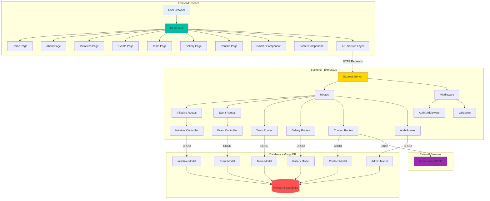
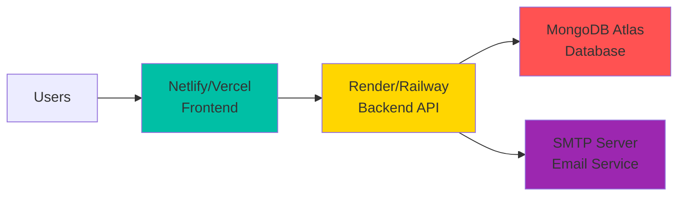

# Ek-Prayas Website Architecture



## Data Flow

### 1. User Request Flow
```
User Browser → React Component → API Service → Express Route → Controller → MongoDB
                     ↑                                                            ↓
                     ←────────────────────── Response ──────────────────────────┘
```

### 2. Authentication Flow
```
Login Form → POST /api/auth/login → Verify Credentials → Generate JWT → Store Token
                                                              ↓
Admin Actions → Include JWT in Headers → Verify Token → Allow/Deny
```

### 3. Contact Form Flow
```
Contact Form → POST /api/contact → Save to DB → Send Email → Response
```

## Technology Stack

### Frontend
- **Framework**: React 18.2
- **Routing**: React Router v6
- **Animations**: Framer Motion
- **HTTP Client**: Axios
- **Icons**: React Icons
- **Forms**: Formik + Yup
- **Notifications**: React Toastify

### Backend
- **Runtime**: Node.js
- **Framework**: Express.js
- **Database**: MongoDB with Mongoose ODM
- **Authentication**: JWT + bcryptjs
- **Email**: Nodemailer
- **Security**: Helmet, CORS, Rate Limiting
- **File Upload**: Multer

### Database Schema

```
Initiatives
├── title
├── slug
├── description
├── shortDescription
├── category
├── image
├── impact { beneficiaries, volunteers, duration }
└── isActive

Events
├── title
├── slug
├── description
├── date
├── location
├── category
├── status
├── attendees
└── organizers (ref: Team)

Team
├── name
├── role
├── designation
├── department
├── bio
├── image
└── social links

Admin
├── username
├── email
├── password (hashed)
├── role
└── isActive
```

## API Endpoints Summary

| Method | Endpoint | Access | Description |
|--------|----------|--------|-------------|
| GET | /api/initiatives | Public | Get all initiatives |
| GET | /api/initiatives/:slug | Public | Get single initiative |
| POST | /api/initiatives | Admin | Create initiative |
| PUT | /api/initiatives/:id | Admin | Update initiative |
| DELETE | /api/initiatives/:id | Super Admin | Delete initiative |
| GET | /api/events | Public | Get all events |
| GET | /api/events/:slug | Public | Get single event |
| POST | /api/events | Admin | Create event |
| GET | /api/team | Public | Get team members |
| GET | /api/gallery | Public | Get gallery images |
| POST | /api/contact | Public | Submit contact form |
| POST | /api/newsletter | Public | Subscribe newsletter |
| POST | /api/auth/login | Public | Admin login |

## Environment Variables

### Backend (.env)
```
PORT=5000
MONGODB_URI=mongodb://localhost:27017/ekprayas
JWT_SECRET=your_secret_key
NODE_ENV=development
FRONTEND_URL=http://localhost:3000
EMAIL_USER=your-email@gmail.com
EMAIL_PASS=your-password
```

### Frontend (.env)
```
REACT_APP_API_URL=http://localhost:5000/api
REACT_APP_SITE_NAME=Ek-Prayas
```

## Deployment Architecture



---

This architecture ensures:
- ✅ Scalability
- ✅ Security
- ✅ Maintainability
- ✅ Performance
- ✅ Easy deployment
